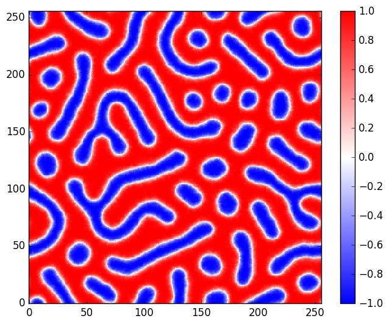
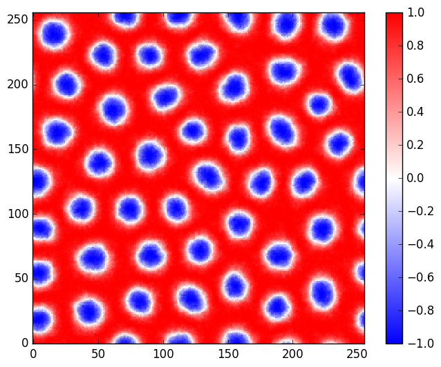

# Micromagnetic-GPU-Monte-Carlo

This is a GPU-accelerated micromagnetic simulation program to study the static behavior of the micromagnets using a Monte Carlo (MC) algorithm. It is a cross-platform (Windows, Linux) software written in C++ and CUDA. Finite difference (FD) discretization is employed to describe the space dependent magnetization. Simulating the annealing process, the performance is better than OOMMF and MuMax3 (time integration may cost extra time, while MC is free from that).

## Features:
- Magnetostatic field (FFT-accelerated convolution theorem, N logN)
- Heisenberg exchange interaction
- Interfacial Dzyaloshinskii-Moriya interaction (DMI)
- Magneto-crystalline anisotropy
- Periodic boundary condition (PBC) along any direction (1D, 2D, or 3D)
- Load and output Vector field format (OVF) files, which are supported by OOMMF and MuMax3
- Optional single (32-bit) and double (64-bit) precision

## Demo

Final state 1:

Cooling process 1:


Final state 2:

Cooling process 2:


## Refs:
> https://arxiv.org/abs/1411.7188

> https://github.com/micromagnetics/70LinesOfNumpy

> https://arxiv.org/abs/1406.7635

> https://github.com/mumax/3

> http://math.nist.gov/oommf/doc/userguide11b2/userguide/vectorfieldformat.html

> https://arxiv.org/abs/1612.06622

## PS:
For some reasons, the code uploaded here is not complete. For more information, please contact me.

## Example input configuration file:
```ini
nx = 256
ny = 256
nz = 1
dx = 1e-9
dy = 1e-9
dz = 0.8e-9

Bextx = 0
Bexty = 0
Bextz = 0.3

pbc_x = 20
pbc_y = 20
pbc_z = 0

ms = 1.6e6
Aex = 16e-12
Dind = 6e-3

anisUx = 0
anisUy = 0
anisUz = 1
Ku1 = 2e6

use_random_init = true
randomseed = 256
ovf_filename = B_0_175_D_5_500_nx_100_ny_58_r_15_1.ovf

Temperature_start = 1400
Temperature_end = 40
Temperature_step = 0.90
Temperature_use_exp = true

circle_per_stage  = 100000
terminal_output_period = 10001
energy_output_period = 10001
ms_output_period = 10001

rand_block_size = 40

cal_demag_flag = true
```
